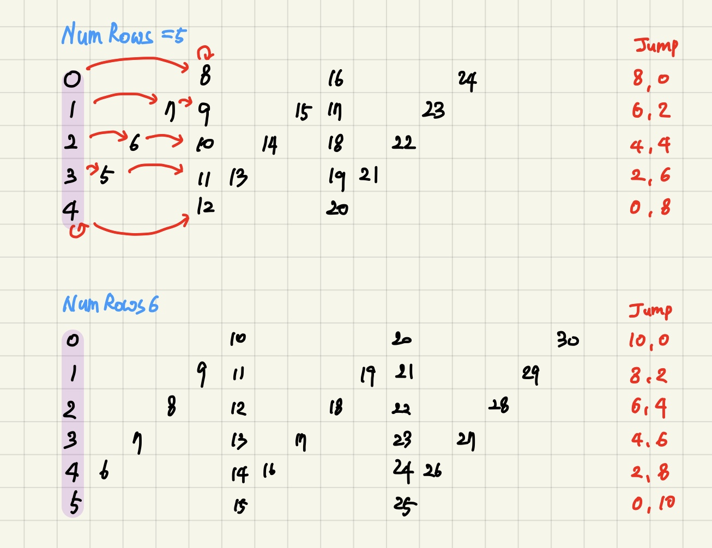

# 6. ZigZag Conversion

## Solution 2

- 시간복잡도: O(N)

- 알고리즘 : 완전탐색

- 풀이설명:

  문자열의 n번 인덱스를 "ZigZag"방식으로 나열하고 첫 행부터 읽은 값을 출력한다.

  numRows가 5면 0 8 16 24 1 7 9 15 17 ... 번째 인덱스를 차례로 출력한다.

  

  numRows가 1이면 입력문자열 s를 그대로 return한다.

  numRows가 2이상이면 인덱스를 jump해 가며 문자를 출력하면 된다. jump는 두 방식(a, b방식이라하자.)이 있고, 번갈아 한다.

  <규칙>

  아래의 내용을 r을 0부터 numRows-1까지 1씩 증가시키며 반복한다.

  1. r행의 첫번째 문자(위 그림에서 보라색으로 칠해짐)는 s의 r번째 문자이다. cursor = r

  2. a방식 점프: (numRows-1-r) \*2 만큼 점프한다. jump = (numRows-1-r)\*2, cursor += jump

     만약 jump가 0이면 직전에 입력한 문자와 같은 문자를 가리키게 되므로 출력문자열에 추가하지 않는다.

     만약 cursor가 s의 인덱스 범위를 벗어나게 되면 r행의 문자입력을 종료한다.

  3. b방식 점프: r\*2만큼 점프한다. jump = r*2, cursor += jump

     만약 jump가 0이면 직전에 입력한 문자와 같은 문자를 가리키게 되므로 출력문자열에 추가하지 않는다.

     만약 cursor가 s의 인덱스 범위를 벗어나게 되면 r행의 문자입력을 종료한다.

  

  코드 부연설명:  

  - for loop 안에서 cursor = -1, jump =r+1을 한 이유: 처음에는 cursor=0, jump=r을 하였다. 어쨌거나 cursor + jump == r이지만, 0번째 행에 대해 예외처리를 따로 안 해줘도 되어서 위와 같은 방식을 선택했다. for loop안에서 cursor와 jump변수를 초기화한 후 while loop안에서 if (jump!=0)검사를 한다. 0번행의 경우에는  r == 0이기 때문에 jump=r을 해 버리면 if(jump !=0) 안의 내용을 실행하지 않는다. 어차피 cursor에 jump를 더한 후, cursor가 가리키는 인덱스의 문자만 Stringbuilder에 append하므로 cursor와 jump의 합만 r이면 결과에 영향을 미치지 않는다. 또한 jump 의 값을 결정할 때, 이전 jump의 값을 활용하지 않으므로 jump = r+1을 해도 알고리즘에 무방하다. 입력되는 numRows의 값은 최대 1000이다.  최대 1000번의 if문 연산을 절약해보았다.

  

- 소스코드

```java
class Solution {
	static StringBuilder sb;

	static public String convert(String s, int numRows) {
		int len = s.length();
		int cursor, jump;
		if (numRows == 1)
			return s;
		sb = new StringBuilder(len); // 입력 문자열의 길이만큼의 공간을 확보해둔다.
		for (int r = 0; r < numRows; r++) {
			cursor = -1;
			jump = r + 1; 
			while (cursor < len) {
				if (jump != 0) {
					cursor += jump; 
					if (!(cursor < len))
						break;
					sb.append(s.charAt(cursor));
				}

				jump = (numRows - 1 - r) * 2;
				if (jump != 0) {
					cursor += jump;
					if (!(cursor < len))
						break;
					sb.append(s.charAt(cursor));
				}
				
				jump = r * 2;
			}
		}
		return sb.toString();
	}

}
```